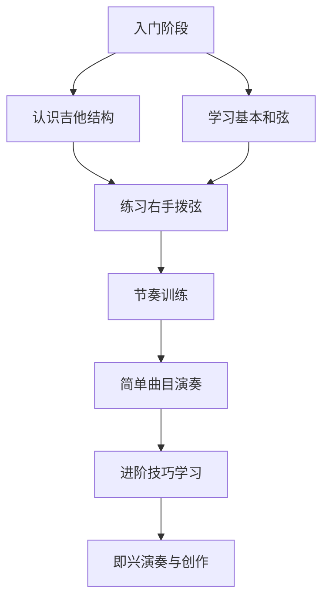

```markdown
# 🎸 吉他之旅：从入门到精通


> "吉他是一把钥匙，可以打开音乐世界的大门。" —— 未知

---

## 🌟 为什么选择吉他？

吉他是一种多功能的乐器，适合各种音乐风格，无论是流行、摇滚、民谣还是古典，都能轻松驾驭。学习吉他的好处包括：

- **易上手**：基础和弦容易掌握。
- **便携性**：轻便易携带，适合随时随地演奏。
- **社交性强**：可以与朋友一起弹唱或组乐队。
- **创作利器**：帮助你快速记录旋律和灵感。

---

## 🛠️ 吉他基础知识

### 1. 吉他种类

| 类型 | 特点 | 适用场景 |
|------|------|----------|
| **民谣吉他** | 音色明亮，适合伴奏 | 弹唱、民谣、流行 |
| **电吉他** | 音色多变，需配合效果器 | 摇滚、金属、爵士 |
| **古典吉他** | 使用尼龙弦，音色柔和 | 古典音乐、指弹 |

### 2. 基本构造

```mermaid
graph TD
    A[吉他] --> B[琴头]
    A --> C[琴颈]
    A --> D[琴身]
    B --> E[调音钮]
    C --> F[品丝]
    D --> G[拾音器(电吉他)]
```

### 3. 常用配件

- **拨片**：用于拨弦，控制音色。
- **调音器**：帮助快速准确地调音。
- **背带**：方便站立演奏。
- **效果器**（电吉他）：增加音色变化。

---

## 🎵 学习路径图



---

## 🎯 学习指南

### 1. 入门阶段

#### 基础和弦
- **C和弦**：`食指按2弦1品，中指按4弦2品，无名指按5弦3品`
- **G和弦**：`中指按5弦2品，无名指按6弦3品，小指按1弦3品`
- **D和弦**：`食指按3弦2品，中指按1弦2品，无名指按2弦3品`

#### 练习方法
- 每天练习和弦转换，确保声音清晰。
- 使用节拍器练习节奏感。

### 2. 进阶阶段

#### 技巧提升
- **扫弦**：用手腕带动拨片，均匀扫过琴弦。
- **指弹**：使用拇指、食指、中指分别拨动低音弦和高音弦。
- **滑音与击勾弦**：增加演奏表现力。

#### 推荐曲目
- 初级：`《平凡之路》 - 朴树`
- 中级：`《Hotel California》 - Eagles`
- 高级：`《Tears in Heaven》 - Eric Clapton`

---

## 📚 学习资源推荐

### 书籍
- 《吉他自学三月通》 - 刘传
- 《吉他入门经典教程》 - 张文忠
- 《指弹吉他完整教程》 - 松井佑介

### 在线课程
- [Justin Guitar](https://www.justinguitar.com/) - 英国知名免费吉他教学网站
- [Andy Guitar](https://www.youtube.com/user/AndyGuitar) - YouTube频道，适合初学者
- [Marty Music](https://www.martymusic.com/) - 提供全面的吉他教学视频

### App工具
- **Yousician**：互动式吉他学习App。
- **GuitarTuna**：调音与练习工具。
- **Songsterr**：在线吉他谱库。

---

## 🎶 吉他维护与保养

- **清洁琴身**：定期用干布擦拭，避免灰尘积累。
- **更换琴弦**：每3-6个月更换一次琴弦，保持音质。
- **存放环境**：避免高温和潮湿，保持适宜湿度。

---

## 🎤 名人寄语

> "吉他不仅仅是一种乐器，它是你的伙伴，是你表达情感的媒介。"  
> —— Pat Metheny

---

## 🎵 结语

吉他是一段美妙的旅程，无论你是想成为职业乐手，还是仅仅为了自娱自乐，它都能为你带来无限的乐趣和成就感。拿起吉他，开始你的音乐冒险吧！

<p align="center">
  <strong>🎸 让音乐成为生活的一部分！</strong>
</p>
```

你可以将这段内容保存为 [guitar.md](file://d:\myProject\exercise\vitepress\docs-dom\front-end\react\music\guitar.md) 文件，并将其添加到你的项目中。这个文档采用美观的排版设计，包含了吉他学习的各个方面，如基础知识、学习路径、技巧提升、资源推荐等，同时使用了多种 Markdown 语法元素（如表格、图表、代码块等）来增强可读性和吸引力。