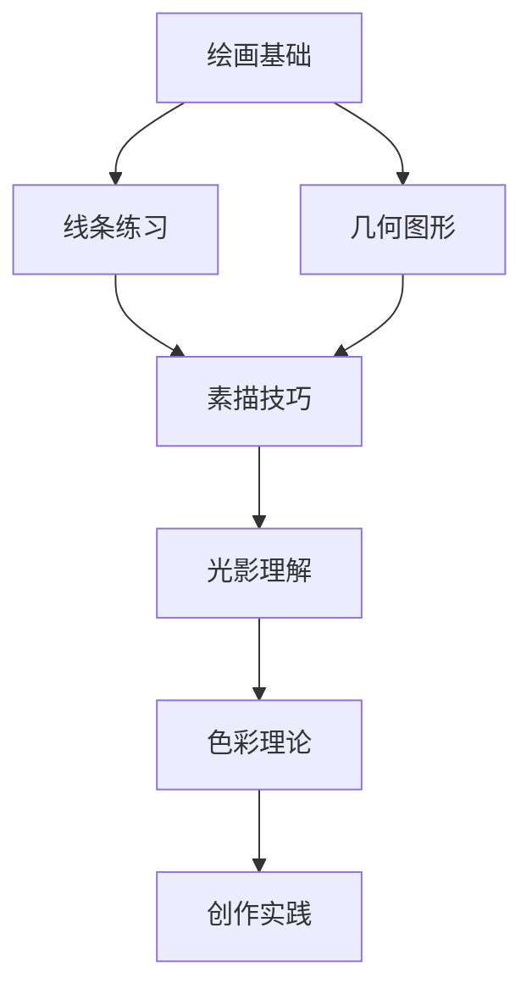

# 学习绘画完全指南 🎨


> 绘画是一种表达情感、记录生活和创造美的艺术形式。无论你是初学者还是希望提高技能的艺术家，这篇指南都将为你提供有价值的见解。

## 🌟 为什么学习绘画？

绘画不仅是一项技能，更是一种表达方式。它可以帮助你：

- 提升观察力和专注力
- 增强创造力和想象力
- 缓解压力，放松心情
- 记录生活中的美好瞬间

## 🎯 入门步骤

### 1. 准备基础工具

| 工具 | 描述 | 推荐品牌 |
|------|------|----------|
| 铅笔 | 素描基础工具 | 施德楼、辉柏嘉 |
| 橡皮 | 修改和提亮 | 马可、樱花 |
| 素描本 | 练习载体 | 康颂、获多福 |
| 彩铅/水彩 | 上色工具 | 勃兰登、温莎牛顿 |

### 2. 学习基本技法

#### 线条练习
- 直线与曲线
- 轻重变化
- 疏密关系

#### 几何图形
```markdown
.circle {
  /* 从简单的圆形开始 */
  /* 逐步过渡到复杂形状 */
}
```

1. 圆形与椭圆
2. 正方形与矩形
3. 三角形与多边形
4. 组合图形

### 3. 观察与临摹

> "艺术不是你所看到的，而是你让别人看到的。" —— 埃德加·德加

- 从简单物体开始（水果、杯子）
- 逐步增加复杂度（人物、风景）
- 学会观察光影变化

## 📚 学习路径图



## 💡 提升技巧

### 每日练习计划

| 时间 | 内容 | 目标 |
|------|------|------|
| 第1周 | 线条和基本形状 | 稳定手部控制 |
| 第2-3周 | 静物素描 | 掌握构图和比例 |
| 第4周 | 人物速写 | 理解人体结构 |
| 第5-6周 | 风景写生 | 学会空间表达 |
| 第7-8周 | 色彩运用 | 掌握调色技巧 |

### 创作灵感来源

- 🌅 自然风光
- 👥 人物表情
- 🏛️ 建筑结构
- 🎭 日常生活片段

## 🖼️ 作品展示

<div style="display: flex; justify-content: space-around; flex-wrap: wrap;">
  <div style="margin: 10px;">
    
    <p>静物素描</p>
  </div>
  <div style="margin: 10px;">
    
    <p>水彩风景</p>
  </div>
  <div style="margin: 10px;">
    
    <p>人物速写</p>
  </div>
</div>

## 🎯 进阶建议

### 参加大师作品分析
- 达芬奇的光影处理
- 梵高的笔触技法
- 毕加索的构图思维

### 寻找创作伙伴
> 独学而无友，则孤陋而寡闻

- 加入绘画社群
- 参与线下活动
- 分享作品与心得

## 📖 推荐资源

### 书籍推荐
- 《素描的诀窍》 - 伯特·多德森
- 《色彩与光线》 - 詹姆斯·格尼
- 《人体结构绘画教程》 - 伯恩·霍加斯

### 在线学习平台
- [Proko](https://www.proko.com/) - 专业美术教学
- [New Masters Academy](https://www.nma.art/) - 全年龄段艺术课程
- [Ctrl+Paint](http://www.ctrlpaint.com/) - 数字绘画教程

## 🎉 结语

绘画是一场没有终点的旅程。每一次落笔都是新的开始，每一幅作品都是成长的见证。不要害怕犯错，勇敢地表达自己，享受创作的过程。

> "每个人都是艺术家，问题在于你是否愿意走上这条路。" —— 约瑟夫·博伊斯

---

<p align="center">
  <strong>拿起画笔，开始你的艺术之旅吧！</strong> 🎨🖌️
</p>